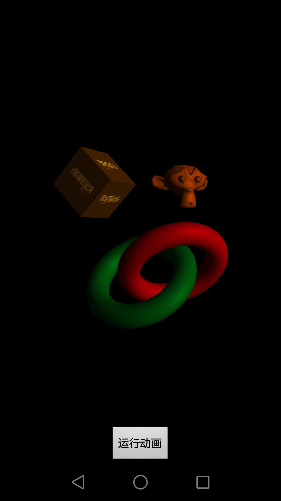

## opengl es 2.0中加载.obj 与 .mtl


项目中有个load obj需求，在网上看了很多的例子，也找了几个开源框架，发现其在**解析obj与mtl文件**上均不完善（其中包括2012年我们几个写的《Android 3D游戏开发技术宝典——OpenGL ES 2.0》）。
比如：
+ **mind3d** 2011年就已停止维护(为opengl es1.0)，并且在加载多图形上存在很大的不兼容。
+ **《Android 3D游戏开发技术宝典——OpenGL ES 2.0》**第九章 3D模型加载。
2012年我们几个在写这本书时，只是简单解析了obj文件，而且对mtl文件并未做解析(看到网上很多的例子是把这一章的案例直接照搬了)

**mind3d官方地址与源码**：
https://code.google.com/archive/p/min3d/
https://github.com/deadmoose/min3d
**《Android 3D游戏开发技术宝典——OpenGL ES 2.0》请自行京东**

我觉得，项目开发中时间紧张，不应该把时间话费在obj与mtl文件解析上。
所以，打算搞一个兼容性较强obj 3d文件加载库，便于以后项目中再次遇到时，可节省大量项目时间。

##效果图



## .obj 和 .mtl文件格式

**对于obj与mtl文件格式不太了解的同学，可参考：**
http://blog.csdn.net/xiaxl/article/details/76893165

##mtl文件解析代码

```java
/**
 * @author xiaxl
 *         <p>
 *         create by xiaxl on 2017.08.09
 *         加载材质工具类
 */
public class MtlLoaderUtil {

    private static final String TAG = "MtlLoaderUtil";


    /**
     * 加载材质的方法
     *
     * @param fname assets的mtl文件路径
     * @param res
     * @return
     */
    public static HashMap<String, MtlData> load(String fname, Resources res) throws Exception {
        // 材质数组
        HashMap<String, MtlData> mMTLMap = new HashMap<String, MtlData>();
        //
        if (res == null || TextUtils.isEmpty(fname)) {
            return mMTLMap;
        }
        //
        MtlData currMtlData = null;
        try {
            // 读取assets下文件
            InputStream in = res.getAssets().open(fname);
            InputStreamReader isr = new InputStreamReader(in);
            BufferedReader buffer = new BufferedReader(isr);
            // 行数据
            String line;
            //
            while ((line = buffer.readLine()) != null) {
                // Skip comments and empty lines.
                if (line.length() == 0 || line.charAt(0) == '#') {
                    continue;
                }
                //
                StringTokenizer parts = new StringTokenizer(line, " ");
                int numTokens = parts.countTokens();
                if (numTokens == 0) {
                    continue;
                }
                //
                String type = parts.nextToken();
                type = type.replaceAll("\\t", "");
                type = type.replaceAll(" ", "");

                // 定义一个名为 'xxx'的材质
                if (type.equals(MtlLoaderUtil.NEWMTL)) {
                    String name = parts.hasMoreTokens() ? parts.nextToken() : "def";
                    // 将上一个对象加入到列表中
                    if (currMtlData != null) {
                        mMTLMap.put(currMtlData.name, currMtlData);
                    }
                    // 创建材质对象
                    currMtlData = new MtlData();
                    // 材质对象名称
                    currMtlData.name = name;
                }
                // 环境光
                else if (type.equals(MtlLoaderUtil.KA)) {
                    currMtlData.Ka_Color = getColorFromParts(parts);
                }
                // 散射光
                else if (type.equals(MtlLoaderUtil.KD)) {
                    currMtlData.Kd_Color = getColorFromParts(parts);
                }
                // 镜面光
                else if (type.equals(MtlLoaderUtil.KS)) {
                    currMtlData.Ks_Color = getColorFromParts(parts);
                }
                // 高光调整参数
                else if (type.equals(MtlLoaderUtil.NS)) {
                    String ns = parts.nextToken();
                    currMtlData.ns = Float.parseFloat(ns);
                }
                // 溶解度，为0时完全透明，1完全不透明
                //else if (type.equals(MtlLoaderUtil.D) || type.equals(MtlLoaderUtil.TR)) {
                else if (type.equals(MtlLoaderUtil.D)) {
                    currMtlData.alpha = Float.parseFloat(parts.nextToken());
                }
                // map_Ka，map_Kd，map_Ks：材质的环境（ambient），散射（diffuse）和镜面（specular）贴图
                else if (type.equals(MtlLoaderUtil.MAP_KA)) {
                    currMtlData.Ka_Texture = parts.nextToken();
                } else if (type.equals(MtlLoaderUtil.MAP_KD)) {
                    currMtlData.Kd_Texture = parts.nextToken();
                } else if (type.equals(MtlLoaderUtil.MAP_KS)) {
                    currMtlData.Ks_ColorTexture = parts.nextToken();
                } else if (type.equals(MtlLoaderUtil.MAP_NS)) {
                    currMtlData.Ns_Texture = parts.nextToken();
                } else if (type.equals(MtlLoaderUtil.MAP_D) || type.equals(MtlLoaderUtil.MAP_TR)) {
                    currMtlData.alphaTexture = parts.nextToken();
                } else if (type.equals(MtlLoaderUtil.MAP_BUMP)) {
                    currMtlData.bumpTexture = parts.nextToken();
                }
            }
            if (currMtlData != null) {
                mMTLMap.put(currMtlData.name, currMtlData);
            }
            buffer.close();
        } catch (Exception e) {
            Log.e(TAG, e.getMessage());
            throw new Exception(e.getMessage(), e.getCause());
        }
        return mMTLMap;
    }

    //####################################################################################


    /**
     * 材质需解析字段
     */
    // 定义一个名为 'xxx'的材质
    private static final String NEWMTL = "newmtl";
    // 材质的环境光（ambient color）
    private static final String KA = "Ka";
    // 散射光（diffuse color）用Kd
    private static final String KD = "Kd";
    // 镜面光（specular color）用Ks
    private static final String KS = "Ks";
    // 反射指数 定义了反射高光度。该值越高则高光越密集，一般取值范围在0~1000。
    private static final String NS = "Ns";
    // 渐隐指数描述 参数factor表示物体融入背景的数量，取值范围为0.0~1.0，取值为1.0表示完全不透明，取值为0.0时表示完全透明。
    private static final String D = "d";
    // 滤光透射率
    private static final String TR = "Tr";
    // map_Ka，map_Kd，map_Ks：材质的环境（ambient），散射（diffuse）和镜面（specular）贴图
    private static final String MAP_KA = "map_Ka";
    private static final String MAP_KD = "map_Kd";
    private static final String MAP_KS = "map_Ks";
    private static final String MAP_NS = "map_Ns";
    private static final String MAP_D = "map_d";
    private static final String MAP_TR = "map_Tr";
    private static final String MAP_BUMP = "map_Bump";

    public static class MtlData {

        // 材质对象名称
        public String name;
        // 环境光
        public int Ka_Color;
        // 散射光
        public int Kd_Color;
        // 镜面光
        public int Ks_Color;
        // 高光调整参数
        public float ns;
        // 溶解度，为0时完全透明，1完全不透明
        public float alpha = 1f;
        // map_Ka，map_Kd，map_Ks：材质的环境（ambient），散射（diffuse）和镜面（specular）贴图
        public String Ka_Texture;
        public String Kd_Texture;
        public String Ks_ColorTexture;
        public String Ns_Texture;
        public String alphaTexture;
        public String bumpTexture;
    }


    //####################################################################################

    /**
     * 返回一个oxffffffff格式的颜色值
     *
     * @param parts
     * @return
     */
    private static int getColorFromParts(StringTokenizer parts) {
        int r = (int) (Float.parseFloat(parts.nextToken()) * 255f);
        int g = (int) (Float.parseFloat(parts.nextToken()) * 255f);
        int b = (int) (Float.parseFloat(parts.nextToken()) * 255f);
        return Color.rgb(r, g, b);
    }
}
```

##obj文件解析代码


```java
/**
 * obj model
 */
public class ObjLoaderUtil {

    private static final String TAG = "ObjLoaderUtil";


    /**
     * 解析
     *
     * @param fname assets的obj文件路径
     * @param res   Resources
     * @return
     */
    public static ArrayList<ObjData> load(String fname, Resources res) throws Exception {
        Log.d(TAG, "---loadObj---");
        // 返回的数据列表
        ArrayList<ObjData> objectList = new ArrayList<ObjData>();
        //
        if (res == null || TextUtils.isEmpty(fname)) {
            return objectList;
        }

        /**
         * 所有顶点信息
         */
        // 顶点数据
        ArrayList<Float> vertices = new ArrayList<Float>();
        // 纹理数据
        ArrayList<Float> texCoords = new ArrayList<Float>();
        // 法向量数据
        ArrayList<Float> normals = new ArrayList<Float>();
        // 全部材质列表
        HashMap<String, MtlLoaderUtil.MtlData> mtlMap = null;

        // Ojb索引数据
        ObjData currObjData = new ObjData();
        // 当前材质名称
        String currMaterialName = null;
        // 是否有面数据的标识
        boolean currObjHasFaces = false;

        //###############################解析开始#################################
        try {
            // 每一行的信息
            String line = null;
            // 读取assets下文件
            InputStream in = res.getAssets().open(fname);
            InputStreamReader isr = new InputStreamReader(in);
            BufferedReader buffer = new BufferedReader(isr);

            // 循环读取每一行的数据
            while ((line = buffer.readLine()) != null) {
                // 忽略 空行和注释
                if (line.length() == 0 || line.charAt(0) == '#') {
                    continue;
                }
                // 以空格分割String
                StringTokenizer parts = new StringTokenizer(line, " ");
                int numTokens = parts.countTokens();
                if (numTokens == 0) {
                    continue;
                }
                // 打头的字符
                String type = parts.nextToken();

                // 材质
                if (type.equals(ObjLoaderUtil.MTLLIB)) {
                    if (!parts.hasMoreTokens()) {
                        continue;
                    }
                    // 需要重命名材质文件(应该取同一路径下的,这里暂时先这么写吧)??????????????????????????????
                    String materialLibPath = parts.nextToken();
                    //#########加载材质信息############
                    if (TextUtils.isEmpty(materialLibPath) == false) {
                        mtlMap = MtlLoaderUtil.load(materialLibPath, res);
                    }

                }
                // 对象名称
                else if (type.equals(ObjLoaderUtil.O)) {
                    // 对象名称
                    String objName = parts.hasMoreTokens() ? parts.nextToken() : "def";
                    // 面数据
                    if (currObjHasFaces) {
                        // 添加到数组中
                        objectList.add(currObjData);
                        // 创建新的索引对象
                        currObjData = new ObjData();
                        currObjHasFaces = false;
                    }
                    currObjData.name = objName;
                    // 对应材质
                    if (TextUtils.isEmpty(currMaterialName) == false && mtlMap != null) {
                        currObjData.mtlData = mtlMap.get(currMaterialName);
                    }
                }
                // "v" 顶点属性 添加到顶点数组
                else if (type.equals(ObjLoaderUtil.V)) {
                    vertices.add(Float.parseFloat(parts.nextToken()));
                    vertices.add(Float.parseFloat(parts.nextToken()));
                    vertices.add(Float.parseFloat(parts.nextToken()));
                }
                // 纹理
                else if (type.equals(ObjLoaderUtil.VT)) {
                    // 这里纹理的Y值，需要(Y = 1-Y0)
                    texCoords.add(Float.parseFloat(parts.nextToken()));
                    texCoords.add(1f - Float.parseFloat(parts.nextToken()));
                }
                // 法向量
                else if (type.equals(ObjLoaderUtil.VN)) {
                    normals.add(Float.parseFloat(parts.nextToken()));
                    normals.add(Float.parseFloat(parts.nextToken()));
                    normals.add(Float.parseFloat(parts.nextToken()));
                }
                // 使用材质
                else if (type.equals(ObjLoaderUtil.USEMTL)) {
                    // 材质名称
                    currMaterialName = parts.nextToken();
                    if (currObjHasFaces) {
                        // 添加到数组中
                        objectList.add(currObjData);
                        // 创建一个index对象
                        currObjData = new ObjData();
                        currObjHasFaces = false;
                    }
                    // 材质名称
                    if (TextUtils.isEmpty(currMaterialName) == false && mtlMap != null) {
                        currObjData.mtlData = mtlMap.get(currMaterialName);
                    }
                }
                // "f"面属性  索引数组
                else if (type.equals(F)) {
                    // 当前obj对象有面数据
                    currObjHasFaces = true;
                    // 是否为矩形(android 均为三角形，这里暂时先忽略多边形的情况)
                    boolean isQuad = numTokens == 5;
                    int[] quadvids = new int[4];
                    int[] quadtids = new int[4];
                    int[] quadnids = new int[4];

                    // 如果含有"//" 替换
                    boolean emptyVt = line.indexOf("//") > -1;
                    if (emptyVt) {
                        line = line.replace("//", "/");
                    }
                    // "f 103/1/1 104/2/1 113/3/1"以" "分割
                    parts = new StringTokenizer(line);
                    // “f”
                    parts.nextToken();
                    // "103/1/1 104/2/1 113/3/1"再以"/"分割
                    StringTokenizer subParts = new StringTokenizer(parts.nextToken(), "/");
                    int partLength = subParts.countTokens();

                    // 纹理数据
                    boolean hasuv = partLength >= 2 && !emptyVt;
                    // 法向量数据
                    boolean hasn = partLength == 3 || (partLength == 2 && emptyVt);
                    // 索引index
                    int idx;
                    for (int i = 1; i < numTokens; i++) {
                        if (i > 1) {
                            subParts = new StringTokenizer(parts.nextToken(), "/");
                        }
                        // 顶点索引
                        idx = Integer.parseInt(subParts.nextToken());
                        if (idx < 0) {
                            idx = (vertices.size() / 3) + idx;
                        } else {
                            idx -= 1;
                        }
                        if (!isQuad) {
                            currObjData.vertexIndices.add(idx);
                        } else {
                            quadvids[i - 1] = idx;
                        }
                        // 纹理索引
                        if (hasuv) {
                            idx = Integer.parseInt(subParts.nextToken());
                            if (idx < 0) {
                                idx = (texCoords.size() / 2) + idx;
                            } else {
                                idx -= 1;
                            }
                            if (!isQuad) {
                                currObjData.texCoordIndices.add(idx);
                            } else {
                                quadtids[i - 1] = idx;
                            }
                        }
                        // 法向量数据
                        if (hasn) {
                            idx = Integer.parseInt(subParts.nextToken());
                            if (idx < 0) {
                                idx = (normals.size() / 3) + idx;
                            } else {
                                idx -= 1;
                            }
                            if (!isQuad) {
                                currObjData.normalIndices.add(idx);
                            } else {
                                quadnids[i - 1] = idx;
                            }
                        }
                    }
                    // 如果是多边形
                    if (isQuad) {
                        int[] indices = new int[]{0, 1, 2, 0, 2, 3};
                        for (int i = 0; i < 6; ++i) {
                            int index = indices[i];
                            currObjData.vertexIndices.add(quadvids[index]);
                            currObjData.texCoordIndices.add(quadtids[index]);
                            currObjData.normalIndices.add(quadnids[index]);
                        }
                    }
                }
            }
            //
            buffer.close();
            // 存在索引面数据，添加到index列表中
            if (currObjHasFaces) {
                // 添加到数组中
                objectList.add(currObjData);
            }
        } catch (Exception e) {
            e.printStackTrace();
            throw new Exception(e.getMessage(), e.getCause());
        }

        //###############################顶点、法向量、纹理一一对应#################################

        // 循环索引对象列表
        int numObjects = objectList.size();
        for (int j = 0; j < numObjects; ++j) {
            ObjData objData = objectList.get(j);

            int i;
            // 顶点数据 初始化
            float[] aVertices = new float[objData.vertexIndices.size() * 3];
            // 顶点纹理数据 初始化
            float[] aTexCoords = new float[objData.texCoordIndices.size() * 2];
            // 顶点法向量数据 初始化
            float[] aNormals = new float[objData.normalIndices.size() * 3];
            // 按照索引，重新组织顶点数据
            for (i = 0; i < objData.vertexIndices.size(); ++i) {
                // 顶点索引，三个一组做为一个三角形
                int faceIndex = objData.vertexIndices.get(i) * 3;
                int vertexIndex = i * 3;
                try {
                    // 按照索引，重新组织顶点数据
                    aVertices[vertexIndex] = vertices.get(faceIndex);
                    aVertices[vertexIndex + 1] = vertices.get(faceIndex + 1);
                    aVertices[vertexIndex + 2] = vertices.get(faceIndex + 2);
                } catch (Exception e) {
                    e.printStackTrace();
                }
            }
            // 按照索引组织 纹理数据
            if (texCoords != null && texCoords.size() > 0) {
                for (i = 0; i < objData.texCoordIndices.size(); ++i) {
                    int texCoordIndex = objData.texCoordIndices.get(i) * 2;
                    int ti = i * 2;
                    aTexCoords[ti] = texCoords.get(texCoordIndex);
                    aTexCoords[ti + 1] = texCoords.get(texCoordIndex + 1);
                }
            }
            // 按照索引组织 法向量数据
            for (i = 0; i < objData.normalIndices.size(); ++i) {
                int normalIndex = objData.normalIndices.get(i) * 3;
                int ni = i * 3;
                if (normals.size() == 0) {
                    throw new Exception("There are no normals specified for this model. Please re-export with normals.");
                }
                aNormals[ni] = normals.get(normalIndex);
                aNormals[ni + 1] = normals.get(normalIndex + 1);
                aNormals[ni + 2] = normals.get(normalIndex + 2);
            }
            // 数据设置到oid.targetObj中
            objData.aVertices = aVertices;
            objData.aTexCoords = aTexCoords;
            objData.aNormals = aNormals;
            //
            if (objData.vertexIndices != null) {
                objData.vertexIndices.clear();
            }
            if (objData.texCoordIndices != null) {
                objData.texCoordIndices.clear();
            }
            if (objData.normalIndices != null) {
                objData.normalIndices.clear();
            }
        }
        return objectList;
    }

    //###################################################################################
    /**
     * obj需解析字段
     */
    // obj对应的材质文件
    private static final String MTLLIB = "mtllib";
    // 组名称
    private static final String G = "g";
    // o 对象名称(Object name)
    private static final String O = "o";
    // 顶点
    private static final String V = "v";
    // 纹理坐标
    private static final String VT = "vt";
    // 顶点法线
    private static final String VN = "vn";
    // 使用的材质
    private static final String USEMTL = "usemtl";
    // v1/vt1/vn1 v2/vt2/vn2 v3/vt3/vn3(索引起始于1)
    private static final String F = "f";


    //###################################################################################

    public static class ObjData {

        // 对象名称
        public String name;
        // 材质
        public MtlLoaderUtil.MtlData mtlData;

        /**
         * 顶点、纹理、法向量一一对应后的数据
         */
        public float[] aVertices;
        // 顶点纹理可能会没有
        public float[] aTexCoords;
        public float[] aNormals;

        /**
         * index数组(顶点、纹理、法向量一一对应后，以下三个列表会清空)
         */
        // 顶点index数组
        public ArrayList<Integer> vertexIndices = new ArrayList<Integer>();
        // 纹理index数组
        public ArrayList<Integer> texCoordIndices = new ArrayList<Integer>();
        // 法向量index数组
        public ArrayList<Integer> normalIndices = new ArrayList<Integer>();

    }
}
```

## 项目地址：
https://github.com/xiaxveliang/GL_Anima_LoadFrom_Obj


## 参考：
本文参考了[Rajawali](https://github.com/xiaxveliang/Rajawali)


